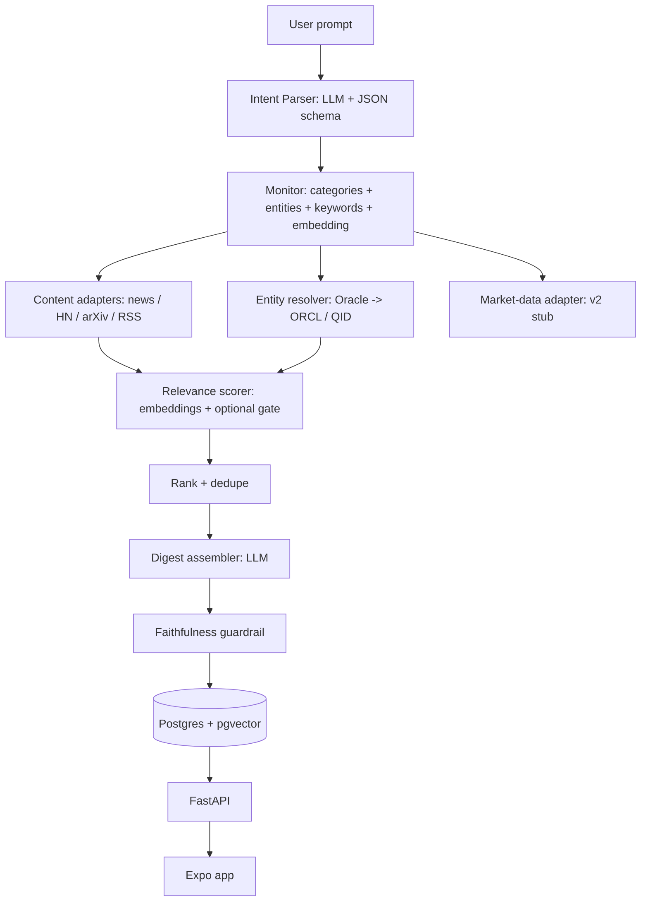

# Daily News Digest App — Project Plan

> Status: v1 plan, locked after design discussion (see `llmwiki/wiki/learnings/daily-news-digest-app/`).
> Last updated: 2026-08-12

## 1. Overview

A mobile app where a user selects topics and/or free-text prompts and receives a **daily digest** of news and content from multiple sources — news articles, Hacker News, arXiv, and (later) Twitter/Reddit. The UI is Inshorts-style: a terse summary per topic, tap to expand into detail.

The app absorbs AI + hosting cost for now, with per-user limits. The backend aggregates content and generates one digest per user, daily. **V1 targets a single fixed user.**

---

## 2. Scope

### In scope (v1)

- Single fixed user (no auth; `user_id` hardcoded but present on every table).
- Sources: **Hacker News (Algolia API) + arXiv + 2–3 topic RSS feeds**.
- Free-text topic/prompt input (variable prompts are the core design) + a small starter preset list.
- Daily digest generation (short ≤60-word summary + expandable detail per item).
- Mobile app: **Android** (sideload APK) + **iOS preview via simulator** (no iOS shipping yet).
- Poll-based delivery (no push notifications yet).

### Non-goals (deferred)

- Auth / multi-user (schema is shaped for it, not implemented).
- Twitter/X (expensive API) — Reddit/Mastodon as later stand-ins.
- Market data (stock price / analyst ratings) — adapter interface reserved, deferred to v2.
- Push notifications (Expo Push reserved).
- iOS shipping / TestFlight (Expo Go + simulator only for now).
- Monetization.

---

## 3. Core pipeline

Five stages, run daily per user:

1. **Collect** — pull candidate items from source adapters.
2. **Match** — score each item against the user's monitors (topics).
3. **Rank + dedupe** — keep top K per monitor, collapse cross-source duplicates.
4. **Summarize** — LLM turns ranked items into a structured digest (short + long forms).
5. **Deliver** — persist, serve via API, app polls and renders.

The linchpin is a **normalized item schema** — every adapter emits the same shape, so matching/summarizing/UI are source-agnostic.

---

## 4. Architecture & components



| Component | Responsibility |
|---|---|
| **Intent Parser** | One-time LLM call (strict JSON schema): free-text prompt → structured monitor (categories, entities, keywords, data_requests, sources). |
| **Entity Resolver** | Disambiguate named entities (Oracle company vs "oracle bones") and resolve to a stable ID + ticker (ORCL) / Wikidata QID. |
| **Source adapters** | Each fetches + normalizes one source into the item schema. |
| **Relevance scorer** | Hybrid: category classifier + entity (NER) match + keyword/embedding similarity → rank. |
| **Digest assembler** | LLM turns ranked items + structured facts into a structured JSON digest. |
| **LLMService** | Provider-agnostic LLM access (LiteLLM) with task→model config, retries, structured-output parsing. |

---

## 5. Tech stack

| Layer | Choice | Rationale |
|---|---|---|
| Mobile | **Expo (React Native) + TypeScript** | one codebase → Android + iOS; Expo Go for instant testing; EAS Build for APK/IPA |
| Backend | **Python + FastAPI + uv** | matches existing localLlm stack |
| Storage | **Postgres + pgvector** (Docker Compose) | server app, multi-user later, embeddings in-place |
| ORM / migrations | **SQLAlchemy + Alembic** | standard |
| Scheduler | **APScheduler** (in-process cron) | v1 single worker; Celery only when distributed |
| LLM | **LiteLLM + in-repo `LLMService`** | provider-agnostic; switch via config |
| NER | **spaCy or GLiNER** | cheap, deterministic, no LLM call |
| Eval | golden set + precision@8 + BERTScore + LLM-judge | see §10 |

---

## 6. LLM design

### Roles (four distinct uses)

| Role | Runs | Frequency | Model tier |
|---|---|---|---|
| Intent parsing (prompt → monitor) | on subscribe/edit | rare | cheap, temp 0 |
| Relevance gate (borderline items) | per item × topic | high | cheap y/n, optional |
| Digest summarization | per user/day | daily | best cheap model |
| Judge (eval + guardrail) | eval / pre-serve | rare | stronger model |

### Abstraction (locked decision)

Provider-agnostic via **LiteLLM** (one OpenAI-compatible interface over ~100 providers) + a thin **`LLMService`** that maps task → model and centralizes retries/timeouts/parsing.

```python
class LLMService:
    async def structured(self, task, messages, schema: type[BaseModel]) -> BaseModel: ...
    async def chat(self, task, messages) -> str: ...
    async def embed(self, task, texts) -> list[list[float]]: ...
```

Config-driven, per task (switch provider = edit config, zero code change):

```toml
[intent]     model = "gemini/gemini-2.0-flash"        # or openai/gpt-4o-mini, anthropic/..., ollama/...
[summarize]  model = "gemini/gemini-2.0-flash"
[judge]      model = "openai/gpt-4o"
[embedding]  model = "openai/text-embedding-3-small"  # or ollama/nomic-embed-text
```

Caveat: not all models honor strict JSON schemas equally — `LLMService` keeps a fallback (JSON-instruction prompt + parse + retry + validation).

### Hard rules

- **Structured output is non-negotiable** — function calling / JSON-schema output (`response_format`), temperature 0 for intent/NER.
- **The LLM organizes, it does not invent** — it may summarize/cluster/rephrase injected content, but must never fabricate numbers, prices, ratings, URLs, authors, or dates. Price/ratings are injected as structured facts, never generated.
- **Relevance is embeddings-first** — cosine similarity (pgvector), no per-item LLM call; the y/n gate is an optional quality net.
- **Steady-state daily job is LLM-free until summarization** — intent parsing is one-time at add/edit; matching is embeddings + NER.

---

## 7. Data model (v1)

- `users` — `id`, `timezone` (one row).
- `monitors` — `id`, `user_id`, `raw_prompt`, `categories jsonb`, `entities jsonb`, `keywords jsonb`, `embedding vector`, `sources jsonb`, `data_requests jsonb`, `limits jsonb`, timestamps. *(A "monitor" = one parsed topic/prompt subscription.)*
- `items` — `id`, `source`, `source_id`, `url`, `title`, `body`, `author`, `published_at`, `score`, `entities jsonb`, `embedding vector`. `UNIQUE(source, source_id)` = dedup cache.
- `digests` — `id`, `user_id`, `date`, `content jsonb` (one per user/day).
- `digest_items` — `digest_id`, `item_id` (join).

Normalized item schema (adapter contract):

```json
{ "id", "source", "url", "title", "body?", "author", "published_at", "score", "entities": [], "tags": [] }
```

---

## 8. API contract (v1)

- `PUT /topics` — set the user's monitors (body: `[{ "raw_prompt": "..." }]`).
- `POST /refresh` — trigger the pipeline now (dev/test).
- `GET /digest/today` — today's digest (empty/404 if not yet generated).
- `GET /digest/{date}` — a past digest.
- `GET /health`.

---

## 9. Digest generation

Per user/day:

1. Assemble **one** prompt: ranked items (title + body + source + date) grouped by topic, **plus the structured-facts block** (e.g. price/ratings, injected not generated).
2. One LLM call → **structured JSON digest**:

```json
{
  "date": "2026-08-12",
  "topics": [
    {
      "topic": "oracle",
      "summary": "One-paragraph synthesis of today's Oracle news.",
      "items": [
        { "id": "hn:43125792", "title": "…", "short": "≤60 words", "long": "…", "url": "…" }
      ]
    }
  ]
}
```

3. **Faithfulness guardrail** (optional, cheap) flags unsupported claims before serving.
4. Validate against schema; retry once on malformed JSON; store idempotently per (user, date).

---

## 10. Evaluation & quality

- **Golden eval set** — a few hundred (item, topic) pairs hand-labeled relevant/not + a few human-written reference summaries.
- **Relevance**: precision@8 (the user only sees the top few), recall, nDCG. Tune keyword → embeddings → gate on the same labeled set.
- **Summarization**: BERTScore baseline + **LLM-judge faithfulness** (rate 1–5, list unsupported claims). Judge = eval-time tool first, production guardrail second, never a per-request hot-path cost.
- **Implicit feedback later**: clicks, "not interested" taps.

---

## 11. Cost model (app bears cost)

Per user/day with a cheap model (Gemini Flash / GPT-4o-mini): a 20–30 item digest is a few thousand tokens in+out → **well under $0.01/user/day**.

Levers:

1. **Shared item cache** — fetch + per-item summary once, deduped across users.
2. **Cheap model tier** for summarize; embeddings for relevance.
3. **Token caps** — 5 topics/user, 8 items/topic, truncate bodies, hard token budget per digest.
4. **Local LLM** (localLlm stack) later — removes per-token cost at the price of ops/latency/quality.

---

## 12. Mobile app & distribution

- **Expo (React Native) + Expo Go**, TypeScript, Expo Push (later).
- Screens: digest feed (topic summary cards) → item detail → topic input.
- Dev loop: `npx expo start` → Android Emulator + iOS Simulator (Xcode) for preview; Expo Go for real devices.
- Distribution:
  - **Android**: `eas build` → sideload `.apk` (host on GitHub/Diawi). Zero cost, zero store.
  - **iOS**: preview only via Expo Go/simulator now; later TestFlight ($99/yr Apple Developer account).

---

## 13. Phased implementation plan

1. **Backend skeleton** — FastAPI + uv + Postgres/Docker + Alembic; models; fixed-user seed; health endpoint.
2. **Source adapters** — HN, arXiv, RSS → normalized items; cache + cross-source dedup.
3. **Intent + relevance** — intent parser (LLM, structured), entity resolver, NER; embeddings + ranking.
4. **Digest generation** — prompt assembly → structured JSON digest → faithfulness guardrail → store.
5. **Scheduling + API** — APScheduler daily job; REST endpoints.
6. **Mobile app** — Expo: digest feed, detail, topic input; Android emulator + iOS simulator.
7. **Eval + smoke test** — golden set, precision@8, faithfulness judge; end-to-end run.

---

## 14. Decisions log

| # | Decision | Choice |
|---|---|---|
| 1 | LLM provider | **LiteLLM + `LLMService`** abstraction (provider-agnostic); v1 default Gemini Flash / GPT-4o-mini |
| 2 | Market data | **Defer to v2** (adapter interface reserved) |
| 3 | Topic model | **Free-text prompts** + small starter preset list |
| 4 | Deployment | **Local Docker Compose** for v1 |
| 5 | Content licensing | **Link + short summary**, permissive sources (HN, arXiv, RSS) |
| 6 | Mobile framework | **Expo (React Native) + TypeScript** |
| 7 | iOS | preview (simulator/Expo Go) now; TestFlight later |
| 8 | Sources | HN + arXiv + 2–3 RSS; defer Twitter |
| 9 | Relevance | embeddings (pgvector) + optional y/n gate |
| 10 | Limits | 5 topics/user, 8 items/topic |

---

## 15. Future work (v2+)

- Multi-user + auth.
- Market data adapter (quotes + analyst consensus) — provider TBD (Finnhub/Alpha Vantage free tiers).
- Twitter/Reddit/Mastodon sources.
- Push notifications (Expo Push) and per-user timezone scheduling.
- Deployment to VPS / managed platform.
- Local LLM serving (localLlm stack) behind `LLMService`.
