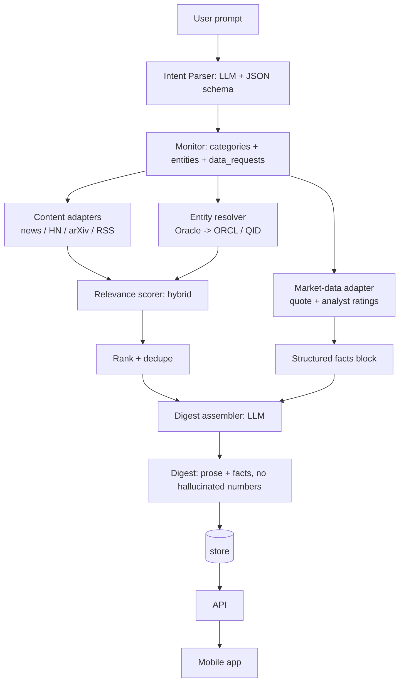
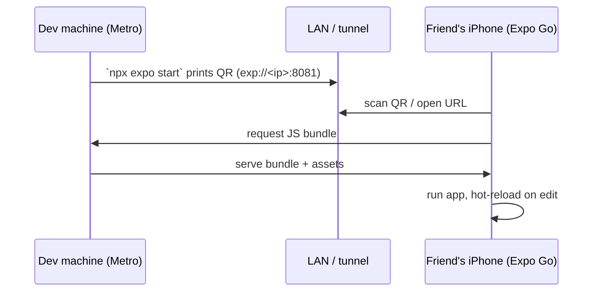
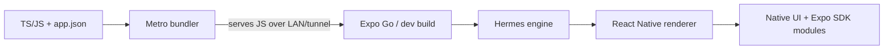
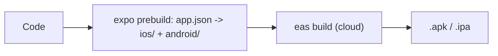
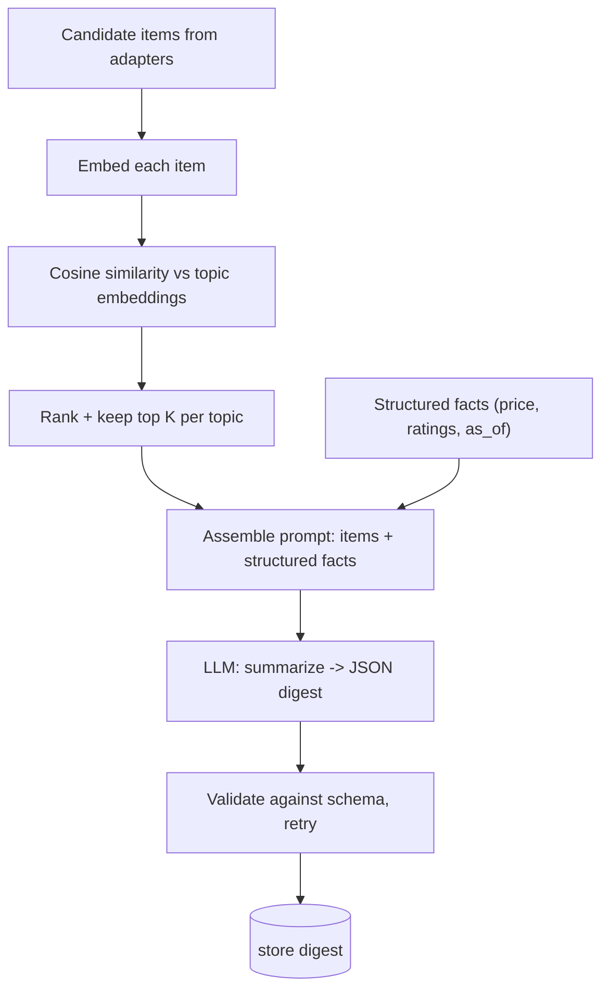

# Daily News Digest App — Discussion

## Topic

Mobile app where users select topics (and/or free-text prompts) and receive a daily digest of news/content from multiple sources — news articles, Hacker News, arXiv, Twitter, etc. Inshorts-style UI: terse summary cards first, tap to expand into detail. The app absorbs AI + hosting cost for now, with per-user limits. Backend aggregates and generates one digest per user daily. V1 = one fixed user.

---

### Q: Give the overall plan, how to build it, and everything needed before implementing.

**Answer:**

## 1. Core pipeline

Five stages, in order:

1. **Collect** — pull candidate items from N source adapters.
2. **Match** — score each item against the user's topics.
3. **Rank + dedupe** — keep top K per topic, drop near-duplicates.
4. **Summarize** — LLM turns ranked items into a digest (short + long forms).
5. **Deliver** — persist, serve to the app, notify.

The single most important design decision is the **normalized item schema** — every source adapter emits the same shape, so matching/summarizing/UI are source-agnostic.

## 2. Source adapters

Each adapter fetches and normalizes into:

```json
{
  "id": "hn:43125792",
  "source": "hackernews",
  "url": "https://news.ycombinator.com/item?id=43125792",
  "title": "…",
  "body": "…",            // optional; raw text if available
  "author": "…",
  "published_at": "2026-08-12T07:00:00Z",
  "score": 842,
  "tags": ["rust", "compiler"]
}
```

Sources, easiest → hardest:

| Source | API | Notes |
|---|---|---|
| Hacker News | Algolia API | free, no key, JSON, already has score/comments |
| arXiv | arXiv API | free, no key, abstracts are already summaries |
| News articles | RSS feeds / NewsAPI / GDELT | RSS = no key; NewsAPI = paid tiers |
| Reddit | JSON `.json` endpoints | free, good topical signal |
| Twitter/X | official API | expensive ($100/mo+), rate-limited — **defer** |

Recommendation for v1: **HN + arXiv + one curated RSS bundle** (topic-relevant feeds). Twitter is a later concern; Reddit/Mastodon are cheaper stand-ins for "social" signal.

## 3. Topic matching

Two tiers, pick by how fuzzy the topics are:

- **Keyword/tag matching** (v1): user topic → keywords; score by title/body/tag overlap. Cheap, deterministic. Then an LLM "is this relevant? y/n" gate to catch false positives.
- **Embeddings** (later): embed topics and items, cosine/nearest-neighbor (pgvector / a vector store). Handles fuzzy topics ("things about ML infra") better. Add only when keyword matching feels brittle.

Recommendation: start keyword + cheap LLM gate; introduce embeddings behind the same `Matcher` interface later.

## 4. Digest generation

Per user, per day:

- Input: ranked items grouped by topic.
- Output: structured digest (JSON), e.g.:

```json
{
  "date": "2026-08-12",
  "topics": [
    {
      "topic": "rust",
      "summary": "One-paragraph synthesis of today's rust news.",
      "items": [
        { "id": "hn:43125792", "title": "…", "short": "≤60-word summary", "long": "…", "url": "…" }
      ]
    }
  ]
}
```

- **Cost control**: cap items per topic (e.g., 8), batch into one prompt per digest, use a cheap/fast model. Cache per-item summaries so re-digests or a second user with the same item don't re-pay.

## 5. Storage

- `topics` (per user), `items` (deduped cache), `digests` (generated, per user/day), `digest_items` (join).
- Postgres via Docker Compose is the boring standard (server app, inherently multi-user later, pgvector for embeddings). SQLite is the zero-ops alternative for a single-user v1.

Recommendation: **Postgres from day one** — cheap to stand up, avoids a migration the moment you add a second user.

## 6. Backend

- **Python + FastAPI** (matches your localLlm stack), `uv`, Pydantic, SQLAlchemy + Alembic.
- Scheduler: **APScheduler** in-process cron for v1 (one job: run the daily pipeline). Upgrade to Celery + Redis beat only when you need distributed workers.
- Job structure: a single `run_daily_pipeline(user_id)` that does collect → match → rank → summarize → store.

## 7. Mobile app

- **React Native + Expo** (cross-platform, fastest MVP, free push via Expo). Flutter if you prefer Dart or want tighter UI control.
- Screens: digest feed (topic summary cards) → tap → item detail → settings (topics).
- V1 can be a simple list + expand; no auth, one hardcoded user.

## 8. Delivery + cost/limits

- Push notification when the digest is ready (Expo push — free).
- **Limits (v1)**: topics per user (e.g., 5), items per topic (e.g., 8), model tier (cheap cloud model; optionally your local LLM — see open questions).

## 9. V1 cut list (single fixed user)

- No auth; hardcoded `user_id`.
- 2–3 sources: HN + arXiv + one RSS bundle. **Defer Twitter.**
- One daily cron job.
- REST: `GET /digest/today`, `GET /digest/:id`, `PUT /topics`, `POST /refresh`.
- RN app: feed + detail + (minimal) topic picker.

## 10. Things to nail down before implementing

1. Mobile framework (RN/Expo vs Flutter) and platforms (iOS, Android, both).
2. LLM provider for summarization — cloud (which?) vs your local LLM stack. Biggest cost/quality/latency tradeoff.
3. Storage — Postgres vs SQLite.
4. Exact v1 sources + which need API keys.
5. Topic model — fixed taxonomy vs free-text prompts vs both.
6. Item + digest JSON schemas (freeze these first — everything else builds on them).
7. Backend hosting target (VPS/Docker, Fly/Railway, etc.).
8. Push vs poll for the app (v1 can poll).

## Open questions for you

- Platforms: iOS, Android, or both?
- LLM: cloud (which provider/model?) vs your local stack?
- Backend deployment target?
- Is Twitter genuinely required, or can v1 swap in Reddit/Mastodon?
- How many topics per user, and how many items per digest?

---

### Q: How does the system actually work end-to-end, and can it handle arbitrary/compound topics like "geopolitics global + middle east" and "tech, specifically Oracle, including Oracle stock price and analyst views"?

**Answer:**

Yes — variable prompts are the *core* design, not an edge case. But your example is actually **three different kinds of intent** that route through three different paths. That distinction is the important part.

## Decomposing your example

Your prompt decomposes into separate "monitors" (subscriptions):

1. **Geopolitics, global + middle east** — a *category/topic* intent. Matches news by classifier + keywords + region tags. Content-source path.
2. **Oracle (the company)** — an *entity* intent. Needs entity resolution (Oracle Corporation → ticker `ORCL`), so we don't confuse it with "oracle" as a word or "oracle bones". Content-source path, entity-filtered.
3. **Oracle stock price + analyst views** — a *structured-data* intent. This is **not news**. Price is a number from a market-data API; analyst views are ratings/price-targets. These must be **fetched as facts, not generated by an LLM** (an LLM will hallucinate a stock price).

So the system needs three retrieval paths behind one unified entry point.

## The mechanism: intent → monitor

When a user types a prompt, an **Intent Parser** (one LLM call with a strict JSON schema) turns it into a structured monitor:

```json
{
  "id": "sub_123",
  "user_id": "u1",
  "raw_prompt": "tech, especially Oracle, incl. stock price and analyst views",
  "categories": ["technology"],
  "entities": [
    { "name": "Oracle", "type": "company", "ticker": "ORCL",
      "resolved": "Oracle Corporation", "wikidata": "Q163491" }
  ],
  "data_requests": ["stock_price", "analyst_ratings"],
  "keywords": ["oracle", "cloud", "database", "earnings"],
  "embedding": [0.12, -0.04, ...],
  "sources": ["news", "hn", "arxiv", "market_data"]
}
```

This parse runs **once at subscription time** (re-run on edit, and cheaply refreshed on a schedule), is stored, and drives the daily job. The daily pipeline iterates the user's monitors, not the raw prompt.

## Entity resolution is the non-obvious hard part

"Oracle" as a *substring* is wrong: it matches "Oracle database 23ai release" (correct) but also "oracle bones unearthed in China" (archeology — wrong). Resolution gives:

- **Disambiguation** — company vs database vs place.
- **A stable ID + ticker** — enables reliable news matching (via NER) and market-data lookup.
- **Aliases** — "Larry Ellison's company", "ORCL" all resolve to the same entity.

For financial entities, resolution to a ticker is what unlocks price/ratings. For general entities (people, places, orgs), a stable ID (Wikidata QID or a vendor entity ID) unlocks reliable NER matching.

## Relevance scoring (hybrid, per monitor)

- **Category classifier** — does this item belong to "technology" / "geopolitics"? (small classifier or cheap LLM).
- **Entity match** — does it mention *resolved* "Oracle Corporation" (NER), not the substring.
- **Keyword + embedding** — for broad topics ("middle east", "global geopolitics").

Combine into a score; rank; dedupe across sources (same story from Reuters + HN = one item).

## Daily flow



## The structured-data caveat (honest answer)

Price and analyst views are **facts**, injected into the prompt as a JSON block and rendered verbatim. The LLM is told "never invent numbers — quote the injected data block." A digest for Oracle looks like:

> **Oracle (ORCL)** — $142.31 · +2.1% today · consensus **Buy**, avg PT $165 *(source: Finnhub, 08:00 UTC)*
> *News synthesis:* Oracle reported… signed a cloud deal with…

Cost/availability reality for market data:

- **Quotes**: Polygon, Finnhub, Alpha Vantage, IEX Cloud — all have free tiers; yfinance is free but licensing-gray for a commercial app.
- **Analyst ratings/targets**: the hardest + most cost-sensitive. Free-ish options are thin (Finnhub "recommendation trends", Alpha Vantage). Proper consensus (TipRanks/Zacks/Benzinga) is paid.

Recommendation: for v1, fetch quotes + whatever consensus the free tier gives, and clearly label the source + timestamp rather than pretending to be a terminal. Analyst views may end up "coverage from the past 24h of news about analysts" (content path) if a real ratings feed is out of budget.

## Cost note (app bears cost)

The shared **item cache** is the main cost lever: fetch + per-item summary happens **once**, deduped across users. If 100 users track "Oracle", we pay for one Oracle fetch + one set of item summaries; only the per-user digest assembly differs. This is what makes a free, app-funded model viable.

## What this changes about the plan

Adds two first-class components to the v1 design: **Intent Parser** and **Entity Resolver**, plus a **market-data adapter** (behind the same adapter interface). The normalized item schema now needs an `entities` field (resolved NER entities) alongside `tags`.

---

### Q: Mobile app — I want both Android and iOS. A test app is fine. What are our options?

**Answer:**

## Options (realistic shortlist)

| Option | Language | iOS test | Android test | Standalone build | Push |
|---|---|---|---|---|---|
| Expo (React Native) | TS/JS | Expo Go (QR, no Apple acct) | Expo Go / APK | EAS Build | Expo Push (free) |
| Flutter | Dart | Xcode sim/device | Android Studio | `flutter build` | FCM + APNs (manual) |
| Native (Swift + Kotlin) | Swift / Kotlin | Xcode | Android Studio | native | native |
| PWA (React/Vue) | TS/JS | browser | browser | n/a | web push (iOS-limited) |

Also in the ecosystem: Kotlin Multiplatform (share logic, native UI), Ionic/Capacitor (web in a shell), .NET MAUI, Tauri mobile (early). None beat the top two for a simple feed + detail app.

## The binding constraint

**iOS development always requires a Mac + Xcode**, regardless of framework. We're on macOS (M4), so fine. Android has no such restriction.

"Test app is fine" changes the math: with **Expo Go** you run on a real iPhone by scanning a QR code — no Apple Developer account, no build step. Flutter and native need Xcode signing even for device testing (simulator is free, but a real device wants signing, and TestFlight needs the paid $99/yr account).

## Recommendation: Expo (React Native)

- **Fastest to a test app on both platforms** — one TS codebase, `create-expo-app`, hot reload, QR to both phones via Expo Go.
- **iOS test friction ≈ zero** — Expo Go sidesteps the Apple Developer account until shipping.
- **Push is free + trivial** — Expo Push; "digest ready" is a notification-driven product.
- **Backend fit** — TS app + Python backend is the standard split; TS has the largest mobile ecosystem.
- **EAS Build** later produces a real APK/IPA without hand-managing Xcode/Gradle.

Flutter is a fine second choice — more opinionated UI toolkit, but no benefit for this app, plus a bit more iOS friction and manual push setup.

## Caveat

Expo Go tests the Expo sandbox only. For a standalone app you'll use EAS Build (free tier) and, for iOS distribution, eventually a $99/yr Apple Developer account. Android stays free (sideload or Play). None of this blocks a "test app."

## Decision

Default: **Expo (React Native) + Expo Go, TypeScript, Expo Push**. Revisit only if Dart/Flutter is specifically preferred.

---

### Q: How does Expo Go actually work? Can my friend run our app on his iPhone?

**Answer:**

## What Expo Go is

Expo Go is a free sandbox app (App Store / Play Store) that is **already compiled and signed** — a generic container that knows how to download and run a JS/React Native bundle. Your app code *is* the bundle; Expo Go is the player.

## The flow



1. You run `npx expo start` — starts the **Metro bundler**, serving your JS bundle + a manifest over the network.
2. Friend installs **Expo Go** (free, App Store).
3. Friend scans the QR (or types the `exp://` URL). Expo Go connects to your dev server, downloads the bundle, runs it.
4. When you edit code, Metro pushes the update — hot reload, no reinstall.

## Yes — friend can run it on iPhone, two ways

1. **Same network (LAN, default)** — both on the same WiFi; scan QR, works instantly. Fastest.
2. **Different network (tunnel)** — `npx expo start --tunnel` routes through Expo's tunnel so the friend can be anywhere (needs internet). Slightly slower/less reliable.

In both cases **your dev machine must stay running and reachable** — Expo Go pulls the bundle from it live. Stop the server and the app can't (re)load. It's dev tooling, not distribution.

## When to move past Expo Go

For a durable app the friend opens anytime:

- **EAS Build** → standalone `.ipa` (iOS) / `.apk` (Android) the friend installs directly. Android is trivial (sideload APK). iOS needs TestFlight (Apple Dev account) or personal-team install.
- **EAS Update** → host the JS bundle on Expo's CDN; the friend's Expo Go (or your built app) loads it over the internet without your machine running.

For v1 "test app" with a friend: **tunnel mode + Expo Go** is zero-friction; graduate to EAS Build when you want something they can keep.

---

### Q: If I serve it on a cloud service with Expo Go, can people use it without an official app? What are the other sideload options (e.g., APK on Android)?

**Answer:**

## Expo Go on the cloud — yes, but clarify "official app"

You avoid publishing **your** app to a store — but every user must still install **Expo Go** (which is itself an official App Store/Play Store app). Two ways to serve it:

1. **Host the Metro dev server on a VPS** + tunnel → users open Expo Go, connect to your server's `exp://` URL. Your server stays up 24/7, no laptop needed.
2. **EAS Update** → host the JS bundle on Expo's CDN; Expo Go loads it over the internet without any dev server running.

Caveats:
- Expo Go is a **development sandbox** — fine for friends/testers, not a real product (slower load, dev chrome, Expo can change it).
- Metro is not a hardened/production server. For a handful of testers it's fine; for real users, build a standalone app.

## Android sideloading — many easy options

| Method | Cost | Notes |
|---|---|---|
| **Direct APK** (EAS Build → `.apk`) | free | send the file, user enables "Install unknown apps" |
| **Host the APK** (GitHub Releases / any URL) | free | share a link; simplest |
| **Diawi / InstallOnAir** | free | upload APK → get an install link |
| **Firebase App Distribution** | free tier | tester emails + Google account; dashboards, auto-update |
| **`adb install app.apk`** | free | only for devices you have wired; dev-only |

Bottom line: **Android needs no store and no Apple/Google account** — build an APK and hand it over.

## iOS sideloading — much more restricted

| Method | Cost | Notes |
|---|---|---|
| **TestFlight** | $99/yr Apple Dev | the standard; up to ~10k external testers, clean native app |
| **Ad-hoc** | $99/yr | register up to 100 device UDIDs, sign a build for those devices |
| **Personal team (free Apple ID)** | free | install on your own device, **7-day expiry**, re-sign weekly |
| **EU alternative stores / AltStore** | free-ish | regulatory (DMA); EU users only; AltStore needs a computer |

Reality: on iOS there is **no clean free sideload**. For letting others test on iPhone, the two realistic paths are:

- **Expo Go + hosted server / EAS Update** — free, no Apple account, but everyone installs Expo Go (dev-flavored).
- **TestFlight** — clean native app, but requires the $99/yr Apple Developer account.

## Recommendation for v1 "friends test it"

- **Android**: sideload an APK (build with EAS Build, host on GitHub/Diawi). Zero cost, zero store.
- **iOS**: start with **Expo Go + tunnel/EAS Update** (free, no account); graduate to **TestFlight** only when you're ready to pay $99/yr for a real standalone app.

---

### Q: How does the iOS "Personal Team" (free signing) actually work?

**Answer:**

## What it is

Apple's **Personal Team** is the free signing identity you get when you sign into Xcode with a plain Apple ID (no paid Developer Program). It lets you build and install apps on **your own device** without paying $99/yr.

## Setup flow

1. Xcode → Settings → Accounts → sign in with a free Apple ID.
2. Xcode auto-creates a "Personal Team" for that Apple ID.
3. Plug in your iPhone; Xcode registers the device's UDID with your Apple ID.
4. Build & run — Xcode generates a free **provisioning profile** bound to that specific device and signs the app with it.

## The restrictions that matter

- **7-day expiry** — the provisioning profile (and the app on your device) stops launching after 7 days; you must rebuild/re-sign to refresh it.
- **Own devices only** — it's tied to devices registered under *your* Apple ID. There is **no distribution**: no TestFlight, no sharing to a friend, no App Store.
- **Few apps at once** — free provisioning caps you to a small number of simultaneously-installed apps (~3).
- **Capabilities gated** — many entitlements are unavailable on a free personal team, notably **Push Notifications**, App Groups, iCloud/HealthKit, some background modes. A paid program is required for push.

## What it means for this project

Personal Team is only for **you testing your own app on your own iPhone**. It does **not** solve "let my friend use it" — there's no way to share a personal-team build. It also blocks push notifications, which matter for "digest ready."

So the practical paths stay:

- **You, on your own iPhone, free**: Personal Team (re-sign weekly) — or just Expo Go.
- **Friend on iPhone, free**: Expo Go + hosted server / EAS Update.
- **Friend on iPhone, proper app**: TestFlight ($99/yr Apple Dev account).

---

### Q: With a paid Apple Developer account, can we launch a test app for a few selected users?

**Answer:**

Yes — that's exactly what **TestFlight** is for. It's Apple's beta-distribution channel, and it ships your *real signed app* (not a sandbox) to testers without going to the public App Store.

## Two tester tiers

| Tier | Limit | Review | Speed |
|---|---|---|---|
| **Internal testers** | up to 100 | **none** | instant |
| **External testers** | up to 10,000 | Beta App Review (lighter than full review) | hours–day for first build |

- **Internal** testers are people you add to your App Store Connect team (their Apple IDs get a role). Builds appear instantly, no review.
- **External** testers are anyone with an Apple ID, invited by email or a **public link**. Each external build must pass **Beta App Review** — a lighter review than the App Store, but still a review (first build can take a day).

## How it works

1. Build the app (Xcode, or **EAS Build** for Expo/RN) → a signed `.ipa`.
2. Upload to **App Store Connect**.
3. In TestFlight, pick a build, add testers (email or public link).
4. Tester installs the free **TestFlight** app, opens your invite, installs your app.
5. Updates push automatically to testers.

## Constraints to know

- External-test builds **expire after 90 days** (re-upload to extend).
- Testers need an Apple ID (free) + the TestFlight app.
- External tier needs Beta App Review each new build (internal tier doesn't).
- No App Store listing, no public users — it's a controlled beta, which is what you want.

## Alternative: Ad-hoc distribution

Register each device's UDID (up to 100 devices/yr), sign an IPA for exactly those devices, install via a link/side-load. No review, no TestFlight app — but manual UDID management and 100-device cap. TestFlight is cleaner in almost every case.

## For this project

With one $99/yr Apple Developer account:

- "A few selected users" → **Internal testers** (≤100, no review, instant). Cleanest.
- Wider beta / public link → **External testers** (Beta App Review applies).

So: **yes, a paid account unlocks a real test app for a few users via TestFlight.** Android stays even simpler (sideload an APK).

---

### Q: For v1 we'll skip iOS, but want an easy path to TestFlight/Expo Go later. And: is there an "Android Studio" equivalent for iOS to preview how the app looks?

**Answer:**

## The "easy to move later" requirement is already met

Expo/React Native gives you this for free — one codebase, three targets with no rewrite:

- **Expo Go** — the same code runs in Expo Go today (scan QR, works on iOS + Android).
- **TestFlight** — later, `eas build` produces the signed `.ipa` from the same code; only build config changes (bundle ID, icon, signing).
- **Android** — `eas build` → `.apk`.

Keep `app.json`/`eas.json` clean and avoid platform-specific hacks, and the iOS cutover is a config step, not code work.

## The iOS equivalent of Android Studio + Emulator

| Android | iOS |
|---|---|
| Android Studio (IDE) | **Xcode** (IDE) |
| Android Emulator (AVD) | **iOS Simulator** |

**Xcode + iOS Simulator** is exactly the thing you're asking about:

- Free, ships with Xcode (App Store download, macOS only — you're on a Mac, so fine).
- Runs real iOS firmware images (any iPhone/iPad model) to preview layout, fonts, gestures, native rendering.
- No Apple Developer account and no physical iPhone needed to use it.

## Run it from Expo

- `npx expo start` then press **`i`** — opens the app in the iOS Simulator (requires Xcode installed).
- Or install **Expo Go in the simulator** and scan the QR like a phone.
- `npx expo run:ios` for a full native dev build in the simulator.

## What the simulator gets right vs. not

Accurate for your purpose: **UI layout, typography, navigation, touch/gestures, native rendering** — enough to judge "how it looks on iOS."

Limited (use a real device when it matters): real network/cellular conditions, performance (runs at Mac CPU speed, not iPhone speed), camera, some sensors, Apple Pay, haptics, push-notification behavior.

## Bottom line

Build and preview on **Android Emulator + iOS Simulator** with the same Expo codebase; skip iOS *shipping* but keep iOS *preview* free and instant. When you later want testers: Expo Go (free) → TestFlight ($99/yr).

---

### Q: Explain Expo — what is it and how does it actually work?

**Answer:**

## The one-liner

Expo is a **framework + toolchain + cloud services** layered on top of **React Native**. It removes the painful native (Xcode/Gradle) setup so you write JS/TS and still get a real native app.

## The foundation: React Native (RN)

RN lets you write a mobile app in JavaScript/TypeScript but render it with **real native components** — actual `UIView`s on iOS and `View`s on Android, not web views. Your JS runs in **Hermes** (a JS engine tuned for mobile), and React drives native rendering through a JS↔native interface (modern RN uses **JSI**, replacing the old async "bridge").

## What Expo adds (the pieces)

| Piece | What it is |
|---|---|
| **Expo SDK** | A version-locked set of libraries wrapping native features (camera, location, push, haptics…) in a clean JS API, guaranteed compatible with each other |
| **Metro** | The bundler (like webpack for RN) that compiles your TS/JSX into one JS bundle |
| **Expo Go** | The sandbox app that downloads and runs your JS bundle (dev/testing only) |
| **Prebuild / CNG** | `npx expo prebuild` generates the native `ios/` and `android/` folders from `app.json` + config plugins — you don't commit or hand-edit native projects |
| **Config plugins** | Declarative native config (permissions, icons, bundle ID) in `app.json` |
| **EAS** | Cloud services: `eas build` (compile APK/IPA), `eas update` (OTA JS updates), `eas submit` (store upload) |

## How it runs — two modes

**Development:**



`npx expo start` runs Metro; it serves your JS bundle over the network. Expo Go (or a dev build) fetches it and runs it. **Fast Refresh** re-serves changed code instantly — no rebuild.

**Production:**



Your JS bundle gets bundled and shipped *inside* the native shell, producing a standalone app.

## Managed vs. native (the key mental model)

- **Managed (default)**: you never touch native code; Expo SDK + config plugins cover most needs. Fastest path, simplest.
- **Custom native code**: if a feature isn't in the SDK, you "prebuild" (generate native folders) and add it directly, or write a config plugin. This is **not** a one-way eject — it's just generating native projects you can still regenerate.
- **Development build**: a custom debug build of *your* app (not Expo Go) that includes your custom native modules — used when Expo Go isn't enough.

## Why it matters for this app

1. **Zero native setup to start** — no Xcode/Gradle hand-holding for v1.
2. **Expo Go** for instant testing (you + friends).
3. **EAS Build** produces the APK (Android) and, later, the IPA (iOS/TestFlight) without managing native toolchains.
4. **Config plugins** keep permissions/push/icons declarative and version-controlled.
5. **One codebase** already targets Android + iOS — so the "skip iOS now, ship later" plan costs nothing at the code level.

---

### Q: Why serve JS over LAN at all? Is it just so changes show up without rebuilding everything?

**Answer:**

Yes — that's exactly it. The LAN serving exists to make the edit → see loop instant by keeping the native binary fixed and streaming only the JavaScript.

## Why a "build" exists at all

Your source is JSX/TypeScript, but the phone's **Hermes** engine runs plain, bundled JavaScript. Before anything runs, Metro must:

- transform JSX → JS and TS → JS,
- resolve `import`/`require` into one graph,
- bundle into a single file the engine can execute.

## Production: the bundle is baked in

In a release build, that JS bundle is **compiled into the native binary** (inside the `.apk`/`.ipa`). To change *anything*, you must re-bundle **and** rebuild the native app **and** reinstall on the device — slow (minutes), so terrible for iterating.

## Development: split "native shell" from "JS"

Expo flips this during development:

- The **native shell** (Expo Go) is fixed — it never needs to rebuild.
- The **JS bundle is not baked in**; instead Metro serves it over the network and pushes changes over a WebSocket.

So when you save a file:

1. Metro incrementally re-bundles only the changed module(s) (ms).
2. It pushes the update to the running app over the WebSocket.
3. **Fast Refresh** swaps the changed component in place — no native rebuild, no reinstall.

That's the whole point of "serving over LAN": the phone fetches the JS from your machine, so the JS is the only thing that ever changes. The LAN (or tunnel) is just the transport for that fetch; same-network is why the phone and machine must see each other.

## The same idea in production = EAS Update

For released apps, "push a new JS bundle without a store review" works the same way, except the bundle is served from **Expo's CDN** (over the internet) instead of your dev machine — still JS-only, still no native rebuild. Native-code changes still require a full build + store release.

---

### Q: Is this split approach standard? Aren't the dev and production pipelines very different?

**Answer:**

Yes, it's standard — and yes, the *pipelines* differ, but the **code is identical**. The difference is confined to the tooling/assembly layer, not your application.

## It's the universal pattern

| Framework | Dev | Production |
|---|---|---|
| Expo / React Native | Metro dev server + Fast Refresh | Metro `production` mode, bundle baked into binary |
| Flutter | hot reload / hot restart | AOT-compiled native |
| Web (Vite / Next) | dev server + HMR + source maps | minified, tree-shaken `build/` |

Every modern JS/native framework does the same split: **dev optimizes for feedback speed; production optimizes for size and performance.**

## What's actually different (and what isn't)

**Identical between dev and prod:**
- your TS/JS source,
- React components, navigation, UI,
- all business logic.

**Different (tooling only):**
- dev: incremental bundles, source maps, HMR, dev warnings, served over the network;
- prod: minified, tree-shaken, dead-code-eliminated, compiled to Hermes bytecode, baked in.

So it's **not** "two codebases" — it's one codebase run through two Metro modes (`expo start` vs `eas build`).

## Where you still need care

- **Environment config** — dev API URL vs prod API URL via `EXPO_PUBLIC_*` vars, not hardcoded.
- **Dev-only code** — guard with `__DEV__`.
- **Custom native modules** — Expo Go can't run them; you use a *development build* (same code, a native debug build) instead.
- **Prod-only issues** — minification, Hermes differences, performance, missing env vars can hide in dev.

## The one real risk + mitigation

You can iterate happily in Expo Go (dev mode) and only hit prod-only bugs late. Mitigation: **test the actual production build (`eas build`) before releasing** — a standard step, not an Expo quirk.

Bottom line: the dev/prod divergence is normal and cheap, because it lives entirely in the build tooling — the application code doesn't fork.

---

### Q: How does the LLM side actually work?

**Answer:**

## The LLM is used in four distinct roles

| Role | Runs | Frequency | Needs | Model tier |
|---|---|---|---|---|
| **Intent parsing** — user prompt → structured monitor | on subscribe / edit | rare | strict JSON, deterministic | cheap + temp 0 |
| **Relevance** — is this item about this topic? | per item × topic | high | cheap, fast | embeddings (no LLM call) + optional y/n gate |
| **Digest summarization** — ranked items → digest | per user / day | daily | quality + structure | best cheap model |
| **Entity extraction (NER)** — pull entities out of items, resolve to ticker/QID | per item | high | deterministic | cheap + temp 0, or a NER lib |

## The daily loop (concrete)



1. Fetch candidates (no LLM — plain API calls).
2. **Embed** items and topics; cosine-similarity ranks relevance. Embeddings replace a per-item LLM call and are ~100× cheaper.
3. Optionally a cheap LLM y/n gate on borderline items.
4. Assemble ONE prompt: ranked items (title + body + source + date) grouped by topic, **plus the structured facts block** (price/ratings injected, never generated).
5. One LLM call → **structured JSON digest** (short ≤60-word summary + long form per item).
6. Validate against the schema; retry once on malformed JSON; store.

## Structured output is non-negotiable

Use **function calling / JSON-schema output** (OpenAI `response_format`, Anthropic tool use, Gemini `responseSchema`), not free prose. Define the digest as a Pydantic schema and have the provider emit exactly that. Temperature 0 for intent/NER; slightly higher (0.3–0.5) allowed for digest prose.

## The one hard rule: the LLM organizes, it does not invent

- The model may **summarize, cluster, and rephrase** injected content.
- It must **never fabricate** numbers, prices, ratings, URLs, authors, or dates. Those come from adapters/structured facts.
- Prompt-level constraints: "only cite items provided; if a fact isn't in the input, omit it."

This is why stock price / analyst views are **injected facts**, not generated — an LLM asked for "Oracle stock price" will confidently hallucinate.

## Cost model (app bears cost) + the levers

Per user/day with a cheap model (Gemini Flash / GPT-4o-mini): a 20–30 item digest is a few thousand tokens in + out → **well under $0.01/user/day**. Levers that keep it there:

1. **Shared item cache** — fetch + per-item summary happens ONCE, deduped across users (100 users on "Oracle" = one summary set).
2. **Cheap model tier** for summarize; embeddings for relevance.
3. **Token caps** — cap items/topic, truncate bodies to first N chars, hard token budget per digest.
4. **Local LLM** — self-host (your localLlm stack) removes per-token cost entirely, at the price of ops + latency + maybe quality.

## Model provider decision

- **Cloud (default for v1)**: Gemini Flash / GPT-4o-mini / Claude Haiku. Zero ops, predictable JSON modes, pay-per-use.
- **Local (your localLlm stack)**: vLLM/Ollama behind an OpenAI-compatible endpoint. Fits "app bears cost" long-term, but adds a GPU, cold-start latency, and JSON-schema support varies by model.
- **Hybrid**: embeddings + cheap gate on a tiny local model; final digest on a good cloud (or local) model.

## Backend integration shape

- One `LLMProvider` interface (so cloud/local swap behind it).
- Per-task model config: `intent_model`, `embedding_model`, `summarize_model`.
- Prompt templates are versioned assets (not inline strings) so you can iterate prompts without redeploying logic.
- Async, with retry + schema validation; digests are idempotent per (user, date) so a crash mid-day can re-run safely.

## For this project's v1

- **Intent parser**: cheap cloud model, temp 0, JSON schema.
- **Relevance**: embeddings (pgvector) + optional y/n gate — no per-item LLM call.
- **Digest**: cheap cloud model (e.g., Gemini Flash) with structured output; swap to local later behind `LLMProvider`.
- **Market data**: no LLM — fetch quote + consensus, inject as facts.

---

### Q: So the query for a topic/prompt is fixed when the user adds it, and the LLM is only needed once at the start — leaving summarization aside?

**Answer:**

Correct, with two sharpening points.

## What's fixed at add-time

When the user adds a topic/prompt, the **Intent Parser** runs once and produces a stored monitor:

- entities (Oracle → ORCL),
- keywords,
- categories,
- an embedding vector,
- which sources to hit + any data requests.

That is the **query definition**, and it's computed once and reused. You do *not* re-run the LLM every day just to re-derive it.

## Nuance 1: fixed *criteria*, not fixed *results*

The query is fixed, but the data it returns is not — the daily run executes the same criteria against a **moving stream of new items**. Same "query", new input, new output. "Fixed" describes the *definition*, not the *answers*.

## Nuance 2: the LLM is (mostly) only-at-start — but not strictly never again

Even setting summarization aside, two light ongoing touches *may* happen:

1. **Relevance gate** — an optional cheap y/n LLM call on borderline items. Not required: embeddings alone (cosine similarity) do the matching with **no LLM call**.
2. **NER on new items** — can be an LLM call, or a deterministic NER library (no LLM).

So the *ideal/cheapest* daily pipeline is **LLM-free until summarization**: embeddings match, a NER lib extracts entities, no model calls. The y/n gate is a **quality safety net**, not a requirement — embeddings-only matching can let a false positive through (e.g., "oracle bones" archeology matching "Oracle"), and the gate is the cheap way to catch those.

## Summary of the split

- **Intent parsing** — one-time LLM, at add/edit.
- **Relevance** — embeddings (no LLM) + optional cheap gate.
- **Summarization** — the only *daily* heavy LLM call (set aside for now).

Your read is right: the expensive/clever LLM work is front-loaded to subscription time; the steady-state daily job is mostly retrieval + vector math, with summarization as the single recurring LLM cost.

---

### Q: What is a NER lib? How do we ensure suggestions and summaries are good? Do we need an LLM-as-judge?

**Answer:**

## 1. What is a NER lib

**NER** = Named Entity Recognition — find spans of text that name a person/org/place/date/ticker, and label them ("Oracle" → ORG, "Middle East" → LOC). A **NER lib** is a specialized model you call locally to do this — cheap, fast, deterministic, no LLM:

| Library | Notes |
|---|---|
| **spaCy** | Python, fast, has NER models out of the box |
| **GLiNER** | "generalist" zero-shot — you supply the entity types you care about (e.g., `company`, `ticker`) |
| **Stanza / Flair** | research-grade, slower |
| **FinBERT-class models** | finance-tuned NER for tickers/companies |

Why a lib instead of an LLM: it's ~free, offline, and predictable for the one job it does — extracting entity spans. An LLM is overkill (and can still mislabel) for this mechanical step.

## 2. Ensuring suggestions (relevance) are good

Relevance is the "suggestions" layer. Evaluate it like any retrieval/ranking problem:

- **Labeled eval set**: a few hundred (item, topic) pairs hand-labeled relevant/not. This is the ground truth everything else is scored against.
- **Metrics**: **precision@K** ("of the top 8 items shown, how many are relevant"), recall, nDCG. Precision@8 is the one that matters for a digest — the user only sees the top few.
- **Tune the pipeline**: compare keyword vs embeddings vs embeddings+gate on the same labeled set; keep what scores highest.
- **Implicit feedback later**: clicks, "not interested" taps become free labels over time.

## 3. Ensuring summaries are good

"Good" for a news digest = **faithful** (no invented facts), **covers the key points**, **concise**. Metric types:

- **Reference-based** (compare to a human-written summary): ROUGE, BERTScore. Cheap but weak for abstractive news — treat as a baseline, not the answer.
- **Faithfulness/groundedness** (reference-free): does the summary assert anything NOT in the source? This is the *critical* check for news, where a hallucinated fact is the worst failure.
- **Human eval**: Likert scores on faithfulness / coverage / conciseness over a small golden set — the real gold standard, done occasionally.

Practical: keep a **golden set** of items + human-written good summaries; score candidates with BERTScore + a faithfulness check; spot-check by eye.

## 4. Do we need an LLM-as-judge?

**LLM-as-judge** = using a (usually stronger) model to score another model's output — e.g., "Given this item and this summary, rate faithfulness 1–5; list any unsupported claims."

- **Where it helps**: the thing deterministic metrics can't measure — faithfulness/hallucination and coverage. Perfect for a news digest.
- **Where it's weak**: judge bias (prefers its own style, length bias, position bias). Mitigate with a fixed rubric, pairwise comparisons, a strong judge model, and calibration against a small human-labeled set.
- **When to use it**: **offline in the eval loop**, not per-user in production. Judge calls are cheap because they're rare.

So: not *required*, but strongly recommended **as an eval tool** (and, optionally, as a cheap production guardrail that flags unsupported claims before a digest is served — valuable when the worst failure is a fake "Oracle acquired X for $5B").

## v1 recommendation

1. Build a small **golden eval set** (relevance labels + a few human summaries).
2. **Relevance**: precision@8 against the labeled set; tune keyword→embedding→gate.
3. **Summarization**: BERTScore baseline + **LLM-judge faithfulness** on the golden set.
4. **Production guardrail** (cheap, optional): a faithfulness check flags digests with unsupported claims before serving.

Judge = eval-time tool first; production guardrail second; never a per-request cost in the hot path.

---

### Q: Let's create a v1 plan. Are there missing things that need discussion?

**Answer:**

## A. Decisions that materially change the build — need your call (default shown)

| # | Decision | Recommended default |
|---|---|---|
| 1 | **LLM provider** — cloud vs local (localLlm) vs hybrid | Cloud **Gemini Flash** (or GPT-4o-mini) for v1, behind an `LLMProvider` interface so local swaps in later |
| 2 | **Market data (Oracle price/ratings) in v1?** | **Defer to v2** — keep the adapter interface, stub it. It's the hardest/most-costly data |
| 3 | **Topic input model** — preset list vs free-text vs both | **Free-text prompts** (the variable-prompt vision) + a small starter preset list |
| 4 | **Deployment target** — local vs VPS vs managed (Fly/Railway) | **Local Docker Compose** for v1 (single user); cloud later |
| 5 | **Content licensing posture** | **Link + short summary** (transformative, no full-text reproduction); prefer permissive sources (HN, arXiv, RSS headlines) |

## B. Things I'll just decide (no discussion needed)

- Postgres + **pgvector** + Alembic; SQLAlchemy.
- Single hardcoded `user_id`, but `user_id` on every table for future multi-user.
- v1 **poll** (no push); Expo Push later.
- Sources: **HN (Algolia) + arXiv + 2–3 topic RSS feeds**.
- NER: spaCy or GLiNER.
- Relevance: embeddings (pgvector) + optional y/n gate.
- Eval: golden set, precision@8, BERTScore + LLM-judge faithfulness.
- Item cache + cross-source dedup; idempotent daily job.
- Limits: 5 topics/user, 8 items/topic.
- Secrets via `.env`.

## C. Data model (v1)

- `users` — id, timezone (one row).
- `monitors` — id, user_id, raw_prompt, categories jsonb, entities jsonb, keywords jsonb, embedding vector, sources jsonb, data_requests jsonb, limits jsonb.
- `items` — id, source, source_id, url, title, body, author, published_at, score, entities jsonb, embedding vector (UNIQUE on source+source_id = dedup cache).
- `digests` — id, user_id, date, content jsonb (one per user/day).
- `digest_items` — digest_id, item_id (join).

## D. API contract (v1)

- `PUT /topics` — set the user's monitors (body: `[{ raw_prompt }]`).
- `POST /refresh` — trigger the pipeline now (dev).
- `GET /digest/today` — today's digest (empty/404 if not generated).
- `GET /digest/{date}` — a past digest.
- `GET /health`.

## E. Phased v1 plan

1. **Backend skeleton** — FastAPI + uv + Postgres/Docker + Alembic; models; fixed-user seed; health.
2. **Source adapters** — HN, arXiv, RSS → normalized items; cache + dedup.
3. **Intent + relevance** — intent parser (LLM, structured), entity resolver, NER; embeddings + ranking.
4. **Digest generation** — prompt assembly → structured JSON digest → faithfulness guardrail → store.
5. **Scheduling + API** — APScheduler daily job; REST endpoints.
6. **Mobile app** — Expo: digest feed, detail, topic input; Android emulator + iOS simulator.
7. **Eval + smoke test** — golden set, precision@8, faithfulness judge; end-to-end run.

## F. Explicit non-goals for v1

Auth/multi-user, Twitter, market data (if deferred), push, iOS shipping, monetization.

---

### Q: LLM provider — make it as abstracted as possible so I can switch providers. Everything else default.

**Answer:**

## Decisions locked

1. **LLM**: provider-agnostic abstraction (below).
2. **Market data**: defer to v2 (adapter interface stubbed).
3. **Topic model**: free-text prompts + small starter preset list.
4. **Deployment**: local Docker Compose for v1.
5. **Licensing**: link + short summary; permissive sources.

## The abstraction: LiteLLM + a thin LLMService

Two layers of insulation:

1. **LiteLLM** — one OpenAI-compatible interface over ~100 providers (OpenAI, Anthropic, Gemini, Bedrock, Azure, Ollama, vLLM, local models). One call shape; switching = change a model string, not code.
2. **In-repo `LLMService`** — maps a *task* → provider/model from config; centralizes retries, timeouts, and structured-output parsing.

### Config-driven, per task

```toml
[intent]     model = "gemini/gemini-2.0-flash"        # or openai/gpt-4o-mini, anthropic/..., ollama/...
[summarize]  model = "gemini/gemini-2.0-flash"
[judge]      model = "openai/gpt-4o"
[embedding]  model = "openai/text-embedding-3-small"  # or ollama/nomic-embed-text
```

Switching provider = edit config. Zero code change.

### Interface (Python sketch)

```python
class LLMService:
    async def structured(self, task: str, messages: list[dict], schema: type[BaseModel]) -> BaseModel: ...
    async def chat(self, task: str, messages: list[dict]) -> str: ...
    async def embed(self, task: str, texts: list[str]) -> list[list[float]]: ...
```

- `structured` uses LiteLLM `response_format=schema` (normalizes provider JSON modes).
- `embed` is separate so the embedding provider can switch independently.

### Caveat to plan for

Not all models honor strict JSON schemas equally (small local models especially). The service needs a fallback: prompt-level JSON instruction + parse + one retry + validation — kept inside `LLMService` so callers never care.

### Why this is the right "abstracted" answer

- LiteLLM already IS the provider abstraction — no hand-rolled adapters for each provider.
- Your `LLMService` adds task→model indirection + reliability (retries/parsing), which LiteLLM doesn't give by itself.
- Local models (vLLM/Ollama) are OpenAI-compatible, so they plug in as `ollama/<model>` with no new code.
